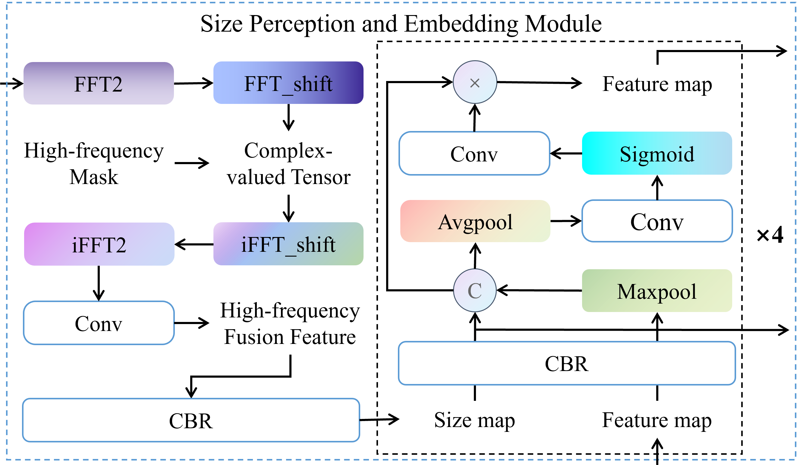
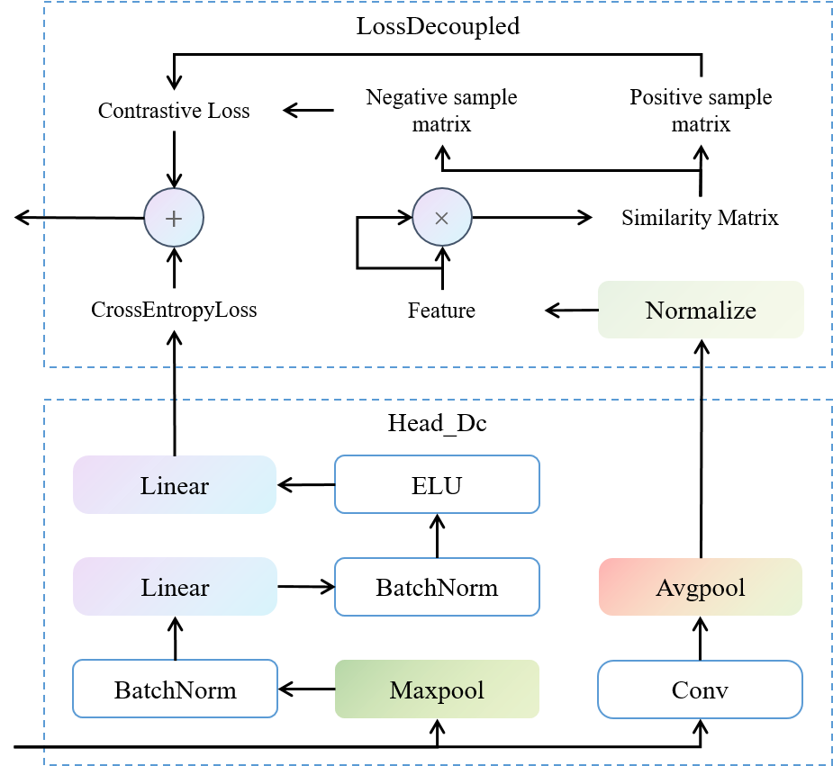

# Towards Ancient Plant Seed Classification: A Benchmark Dataset and Baseline Model

[Rui Xing](https://www.researchgate.net/profile/Rui-Xing-26?ev=hdr_xprf), [Runmin Cong*](https://scholar.google.cz/citations?user=-VrKJ0EAAAAJ&hl), [Yingying Wu](https://www.researchgate.net/profile/Yingying_Wu26), [Can Wang*](https://www.researchgate.net/profile/Can-Wang-21), [Zhongming Tang](http://en.history.sdu.edu.cn/info/1033/1242.htm), [Fen Wang](http://en.history.sdu.edu.cn/info/1032/1236.htm), [Hao Wu](https://www.history.sdu.edu.cn/info/1069/2114.htm), [Sam Kwong](https://scholar.google.com.hk/citations?hl=zh-CN&user=_PVI6EAAAAAJ)

[Paper]() | [BibTex]() | [Dataset]()

## 🚩 Highlights:

**First large-scale ancient plant seed dataset**: We construct the APS dataset, the first large-scale image classification dataset for ancient plant seeds, consisting of 8,340 images across 17 genus- or species-level categories from 18 archaeological sites in China, spanning 5400 BCE to 220 CE.

 

<p align="center">  </p>

**Task-oriented network design for archaeobotany**: We propose APSNet, a dedicated classification framework for ancient plant seeds that addresses the limitations of existing fine-grained and CNN-based methods under archaeological conditions.

<p align="center">  </p>

<!-- **Explicit size-aware feature learning**: A novel Size Perception and Embedding (SPE) module is introduced to explicitly model seed size information, guiding the network to discover key morphological evidence beyond conventional fine-grained texture cues.

<p align="center">  </p>

**Asynchronous decoupled decoding mechanism**: We design an Asynchronous Decoupled Decoding (ADD) architecture that jointly decodes channel-wise and spatial information, enhancing discrimination under high inter-class similarity and severe intra-class variation.

<p align="center">  </p> -->

**State-of-the-art performance and benchmark establishment**: Extensive experiments against 28 representative classification methods demonstrate that APSNet achieves 90.5% accuracy, establishing the first benchmark for ancient plant seed classification in archaeological research.

| Method | Year | Accuracy | Precision | Recall | F1  |
|:---:|:---:|:---:|:---:|:---:|:---:|
| LTR | 2022 | 46.0% | 37.0% | 40.0% | 31.0% |
| LOS | 2025 | 58.2% | 49.8% | 55.2% | 44.9% |
| MetaFormer | 2022 | 57.9% | 36.6% | 34.2% | 32.8% |
| TransXNet | 2025 | 57.9% | 50.4% | 39.2% | 37.0% |
| Swin_tiny | 2021 | 65.1% | 39.5% | 39.5% | 37.9% |
| 2DMamba | 2025 | 61.2% | 46.4% | 42.9% | 42.4% |
| MobileViT_small | 2021 | 72.2% | 47.1% | 49.5% | 44.9% |
| CrossFormer++ | 2024 | 67.9% | 48.2% | 49.9% | 47.8% |
| ViT | 2020 | 68.3% | 53.8% | 51.7% | 49.5% |
| TranFG | 2022 | 75.5% | 53.2% | 56.3% | 52.3% |
| TCFormer | 2024 | 72.3% | 55.7% | 56.4% | 52.7% |
| SeaFormer | 2025 | 72.3% | 54.3% | 56.9% | 53.2% |
| IELT | 2023 | 76.6% | 53.4% | 61.0% | 54.3% |
| HAVT | 2023 | 75.3% | 56.4% | 58.4% | 54.7% |
| AA-Trans | 2023 | 77.5% | 57.6% | 57.5% | 54.9% |
| FET-FGVC | 2024 | 76.9% | 57.2% | 63.0% | 56.7% |
| ConvNext_tiny | 2022 | 66.4% | 44.8% | 44.2% | 43.7% |
| MobileNetv3_large | 2019 | 76.0% | 53.3% | 54.4% | 51.8% |
| VGGNet11_bn | 2014 | 75.0% | 62.0% | 58.4% | 57.1% |
| ResNest50 | 2020 | 81.2% | 60.0% | 61.9% | 57.8% |
| EfficientNetv2_small | 2021 | 79.3% | 54.5% | 61.6% | 57.9% |
| ResNet50 | 2015 | 82.0% | 62.8% | 64.6% | 60.8% |
| GoogleNet | 2014 | 79.2% | 62.0% | 63.5% | 60.9% |
| DenseNet201 | 2017 | 81.2% | 61.5% | 66.7% | 61.5% |
| GhostNetv3 | 2024 | 81.5% | 63.3% | 65.6% | 61.5% |
| ShuffleNetv2_×1.0 | 2018 | 80.9% | 64.2% | 65.4% | 61.8% |
| GhostNet | 2020 | 82.8% | 68.6% | 62.4% | 62.0% |
| GhostNetv2 | 2022 | 84.9% | 66.3% | 70.6% | 65.4% |
| **APSNet** | **Our** | **90.2%** | **77.7%** | **77.7%** | **77.5%** |

## 🛠️Environment Setup

### Requirements

- grad_cam==1.5.5

- numpy==2.3.5

- Pillow==12.0.0

- torch==2.6.0+cu118

- torchinfo==1.8.0

- torchvision==0.21.0+cu118

- tqdm==4.67.1

- Python==3.12.11

### Installation

**Step 1:** Create a conda environment and activate it.

```bash
conda create -n seed python=3.12.11
conda activate seed
```

**Step 3:** Install other dependencies from requirements.txt.

```bash
pip install -r requirements.txt
```
